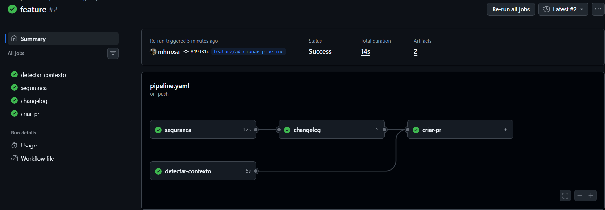
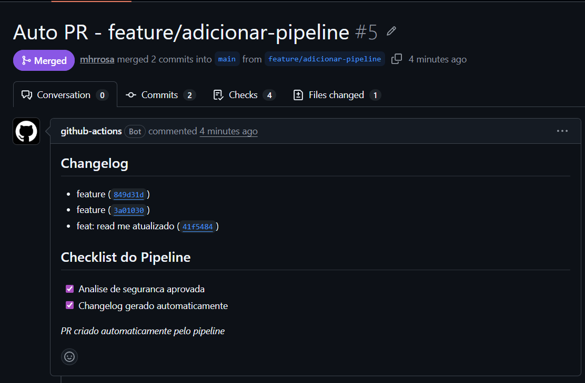

# exemplo-devops-quality-gate

## Objetivo do projeto

Automatizar decisões em um fluxo DevOps usando pipelines inteligentes com suporte de IA generativa para quality gates, observabilidade e agentes autônomos aplicados à SmartShop Cloud.

## Descrição dos pipelines

- **Quality Gate com IA:** executa testes com `pytest`, gera relatório de cobertura (`pytest-cov`) e consulta uma API de IA para decidir `APROVADO` ou `BLOQUEADO`.
- **Observabilidade (Logs):** analisa arquivos em `logs/`, identifica erros críticos e cria issues automaticamente quando necessário.
- **Observabilidade (Métricas):** interpreta JSONs em `metrics/` para detectar degradação e risco operacional.
- **Observabilidade (Traces):** processa `traces/` para identificar gargalos e apontar serviços problemáticos.
- **Agente de Testes:** avalia cobertura e pode bloquear deploys ou criar issues sugerindo correções.
- **Pipeline de Segurança, Changelog e PR Automático:** realiza análise de vulnerabilidades com o agente de IA (GroqCloud) em conjunto com a biblioteca [Bandit](https://bandit.readthedocs.io/), gera changelog automaticamente a partir dos commits e abre Pull Requests de forma autônoma ao detectar push em branches `feature/**` ou `fix/**`.

## Análise de Segurança com IA + Bandit

A análise de segurança do pipeline combina duas camadas:

1. **Bandit** — biblioteca Python de análise estática de segurança que escaneia o código-fonte em busca de vulnerabilidades conhecidas, classificando-as em severidades `LOW`, `MEDIUM` e `HIGH`.
2. **Agente de IA (GroqCloud / LLaMA)** — recebe o relatório do Bandit e decide de forma autônoma se as vulnerabilidades encontradas representam risco real de deploy, respondendo `APROVADO` ou `BLOQUEADO` com justificativa.

> Se nenhuma vulnerabilidade `HIGH` for encontrada, o pipeline aprova automaticamente sem consultar a IA. A IA é acionada apenas quando há vulnerabilidades críticas reais para analisar.

## Exemplos de execução

- **Quality Gate:** cobertura baixa → IA responde `BLOQUEADO` → workflow falha e bloqueia deploy.
- **Logs:** entrada `ERROR Database timeout` ou `CRITICAL Falha na tarefa` → IA classifica como crítica → issue criada automaticamente.
- **Métricas:** `{ "cpu": 92, "memory": 88, "latency_ms": 3000 }` → IA sinaliza risco operacional → alerta/issue gerado.
- **Traces:** `Frontend -> API Gateway -> Payment Service -> Database` com alta latência em `Payment Service` → IA indica `Payment Service` como gargalo.
- **Pipeline de Segurança:** push em `feature/adicionar-pipeline` → Bandit escaneia o código → IA aprova → changelog gerado → PR aberto automaticamente pelo `github-actions[bot]`.

## Tecnologias utilizadas

- Python 3.x
- pytest, pytest-cov
- Bandit (análise estática de segurança)
- GitHub Actions
- GroqCloud API — LLaMA 3.1 8B Instant (agente de IA)
- GitHub CLI (`gh`) para criação automática de Pull Requests

## Critérios de Canary e Quality Gate

Para garantir a qualidade e segurança dos deploys, os seguintes limites (thresholds) são aplicados:

| Componente | Critério | Limite (Threshold) | Ação em caso de falha |
|------------|----------|-------------------|-----------------------|
| **Quality Gate (IA)** | Cobertura de Testes | > 80% (recomendado) | Bloqueio do Deploy |
| **Segurança (IA)** | Vulnerabilidades HIGH | 0 detectadas | Bloqueio do Deploy |
| **Canary Deployment** | Taxa de Sucesso | 90% (mínimo) | Rollback Automático |

## Scripts de Automação

Localizados na pasta `scripts/`:

- `deploy_gate.py`: Consulta a IA (Groq) para decidir sobre o deploy com base em métricas. Usa temperatura 0 para respostas determinísticas.
- `canary_simulator.py`: Simula tráfego canary e monitora taxas de sucesso.
- `rollback_trigger.py`: Executa o rollback fechando PRs ou registrando logs de erro. Possui fallback para ambientes sem `gh` CLI.

## Auditoria e Rastreabilidade

Todos os traces de execução (decisões da IA, passos do canary e triggers de rollback) são salvos em formato JSON na pasta `traces/` com timestamps, permitindo auditoria completa do pipeline.

## Prints das execuções

### Pipeline executado com sucesso

O pipeline executa 4 jobs em sequência: **seguranca** → **changelog** → **criar-pr**, com **detectar-contexto** rodando em paralelo para capturar o nome da branch. A análise de segurança é realizada pelo agente de IA em conjunto com o Bandit.

### Pull Request criado automaticamente

Ao final do pipeline, o `github-actions[bot]` abre um Pull Request automaticamente com o changelog gerado a partir dos commits e o checklist de etapas concluídas pelo pipeline.

